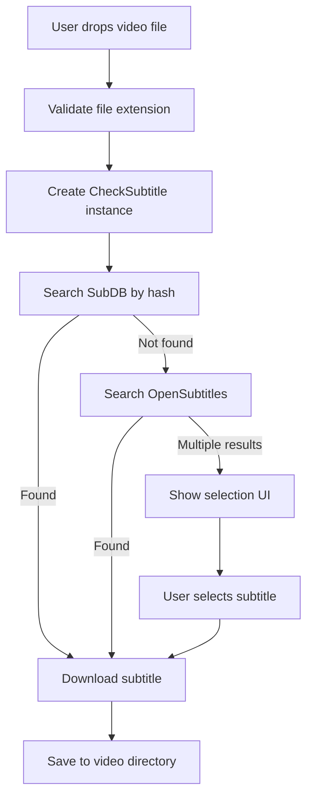

gSubs is built with Electron, which uses a multi-process architecture. This guide explains how the code is organized and how different parts work together.

## Project structure

The codebase is organized as follows:

```
gsubs/
├── main.js              # Main process entry point
├── package.json         # Dependencies and scripts
├── electron-builder.yml # Build configuration
├── app/
│   ├── view/
│   │   └── index.html  # Main window HTML
│   ├── renderer/
│   │   ├── index.js    # Renderer process logic
│   │   └── checksub.js # Subtitle checking module
│   ├── js/
│   │   ├── jquery-3.1.1.min.js
│   │   ├── jquery-ui.min.js
│   │   └── semantic.min.js
│   ├── css/            # Semantic UI styles
│   ├── fonts/          # Icon fonts
│   └── img/            # Application images and logos
└── build/              # Platform-specific icons
```

## Electron architecture

Electron apps use a multi-process architecture:

<Tabs>
  <Tab title="Main Process">
    The main process runs Node.js and controls the application lifecycle.

    **Location**: `main.js`

    **Responsibilities**:
    - Creating browser windows
    - Managing application lifecycle
    - Handling auto-updates
    - IPC (Inter-Process Communication) with renderer

    ### Key components

    ```javascript main.js
    const electron = require('electron');
    const app = electron.app;
    const BrowserWindow = electron.BrowserWindow;
    const autoUpdater = require("electron-updater").autoUpdater;
    const {ipcMain} = require('electron');
    ```
  </Tab>

  <Tab title="Renderer Process">
    The renderer process runs the web page (HTML, CSS, JavaScript).

    **Location**: `app/renderer/index.js`

    **Responsibilities**:
    - UI logic and interactions
    - Subtitle search functionality
    - File handling (drag and drop)
    - Communication with subtitle APIs

    ### Key components

    ```javascript app/renderer/index.js
    const CheckSubtitle = require('../renderer/checksub.js');
    const remote = require('electron').remote;
    const Store = require('electron-store');
    const OS = require('opensubtitles-api');
    const SubDb = require("subdb");
    ```
  </Tab>
</Tabs>

## Main process (`main.js`)

The main process is the entry point of the application.

### Window creation

```javascript main.js:19-53
function createWindow() {
  mainWindow = new BrowserWindow({
    title: "gSubs",
    width: 344,
    height: 540,
    resizable: false,
    frame: false,
    transparent: true,
    maximizable: false,
    fullscreenable: false,
    webPreferences: {
      nodeIntegration: true
    }
  });

  mainWindow.loadURL(url.format({
    pathname: path.join(__dirname, 'app', 'view', 'index.html'),
    protocol: 'file:',
    slashes: true
  }));
}
```

<Note>
  The window is frameless and transparent, giving gSubs its custom appearance. The UI is rendered entirely using HTML/CSS.
</Note>

### Auto-update system

The app checks for updates on startup:

```javascript main.js:59-79
app.on('ready', function() {
  createWindow();
  autoUpdater.checkForUpdates();
});

autoUpdater.on('update-downloaded', (info) => {
  mainWindow.webContents.send('updateReady');
});

ipcMain.on("quitAndInstall", (event, arg) => {
  autoUpdater.quitAndInstall();
});
```

**Flow**:
1. App starts and checks for updates
2. When update is downloaded, notify the renderer process
3. User clicks "Install" button
4. Renderer sends `quitAndInstall` message to main process
5. App quits and installs the update

## Renderer process (`app/renderer/index.js`)

The renderer process contains the application logic and UI interactions.

### State management

Global state is managed using simple variables and electron-store:

```javascript app/renderer/index.js:27-32
global.store = new Store();
global.globalToken = "";
global.multiindex = 0;

var deepSearchToken = "";
```

- **store**: Persistent storage for user preferences (language)
- **globalToken**: Tracks current page/operation (empty = home page)
- **multiindex**: Counter for multiple file operations
- **deepSearchToken**: Tracks deep search operations

### Subtitle sources

Two subtitle sources are initialized:

```javascript app/renderer/index.js:9-25
const OS = require('opensubtitles-api');
const OpenSubtitles = new OS({
    useragent: 'gsubs',
    username: 'gsubs',
    password: '2e6600434b69735881a7ebe19ffc59ee',
    ssl: true,
});

var SubDb = require("subdb");
var subdb = new SubDb();
```

**Search order**:
1. SubDB (hash-based matching) - checked first
2. OpenSubtitles (metadata and search) - fallback

### Core features

<AccordionGroup>
  <Accordion title="Drag and drop" icon="hand">
    Handled by jQuery event listeners:

    ```javascript app/renderer/index.js:217-328
    $(document).on({
      dragover: function (e) {
        // Show drop zone
      },
      drop: function (e) {
        // Validate files and start subtitle search
      }
    });
    ```

    **Supported formats**: `.m4v`, `.avi`, `.mpg`, `.mp4`, `.webm`, `.mkv`

    **Process**:
    1. Files dragged into the window
    2. Validate file extensions
    3. Create `CheckSubtitle` instance for each file
    4. Execute subtitle search
  </Accordion>

  <Accordion title="Search functionality" icon="magnifying-glass">
    Text search uses OpenSubtitles API:

    ```javascript app/renderer/index.js:172-214
    $("#search-box-id").keyup(function (event) {
      if (event.keyCode === 13) {
        querySearch(searchBoxValue, successCB, errorCB);
      }
    });

    function querySearch(query, successCB, errorCB) {
      OpenSubtitles.search({
        sublanguageid: languageCodeto3Letter(store.get('lang')),
        query: query,
        limit: 'all'
      }).then(result => {
        // Handle results
      });
    }
    ```

    Results are displayed in a table with download buttons.
  </Accordion>

  <Accordion title="Language selection" icon="flag">
    Language preference is stored persistently:

    ```javascript app/renderer/index.js:46-62
    // Initialize default language
    if (typeof store.get('lang') == 'undefined') {
        store.set('lang', 'en');
    }

    // Update language selection
    $('#language-select-id').on('click', e => {
        var value = $('#language-select-id').dropdown('get value');
        store.set('lang', value);
    });
    ```

    **Supported languages**: en, es, fr, it, nl, pl, pt, ro, sv, tr
  </Accordion>

  <Accordion title="Subtitle download" icon="download">
    Downloads are handled via HTTPS streams:

    ```javascript app/renderer/index.js:748-845
    $('body').on('click', 'div.download-btn', function () {
      var fullPath = $(this).data("fullpath");
      var downloadURL = $(this).data("url");

      var file = fs.createWriteStream(fullPath);
      var request = https.get(downloadURL, function (response) {
        response.pipe(file);
      });
    });
    ```

    **Behavior**:
    - For drag & drop: Save to video directory
    - For search: Show save dialog
  </Accordion>
</AccordionGroup>

## Subtitle checking module (`app/renderer/checksub.js`)

This module encapsulates the subtitle search logic:

```javascript
class CheckSubtitle {
  constructor(filename, filepath, language, index) {
    this.filename = filename;
    this.filepath = filepath;
    this.language = language;
    this.index = index;
  }

  checkSubSingle(errorCB, failureCB, successCB, partialSuccessCB, token) {
    // Single file subtitle search
  }

  checkSubMulti(errorCB, successCB, partialSuccessCB, token) {
    // Multiple files subtitle search
  }
}
```

**Search strategy**:
1. Try SubDB (hash-based)
2. If failed, try OpenSubtitles (metadata-based)
3. If multiple matches, show selection UI

## UI framework

The UI is built with:

- **jQuery** (3.3.1) - DOM manipulation and events
- **jQuery UI** - Additional UI components
- **Semantic UI** - CSS framework for styling

### Transitions and animations

```javascript app/renderer/index.js:35-37
$(document).ready(function () {
    $('body').transition('scale');
});
```

Semantic UI's transition module handles:
- Scale animations for showing/hiding elements
- Shake animations for errors
- Fade transitions for page changes

## Data flow

Here's how data flows through the application:



## IPC communication

Communication between main and renderer processes:

<CodeGroup>
```javascript Main → Renderer
// Send update notification
mainWindow.webContents.send('updateReady');
```

```javascript Renderer → Main
// Request app restart for update
ipcRenderer.send('quitAndInstall');
```
</CodeGroup>

## Best practices

When working with the codebase:

<CardGroup cols={2}>
  <Card title="Use tokens" icon="ticket">
    Token system prevents race conditions when switching pages quickly
  </Card>
  <Card title="Error handling" icon="shield-halved">
    Always provide callbacks for success, failure, and error scenarios
  </Card>
  <Card title="Async operations" icon="clock">
    Use promises and callbacks properly to handle async subtitle searches
  </Card>
  <Card title="State management" icon="database">
    Check globalToken before updating UI to prevent stale updates
  </Card>
</CardGroup>

## Next steps

<CardGroup cols={2}>
  <Card title="Setup" icon="code" href="/development/setup">
    Set up your development environment
  </Card>
  <Card title="Contributing" icon="code-pull-request" href="/development/contributing">
    Learn how to contribute to gSubs
  </Card>
</CardGroup>